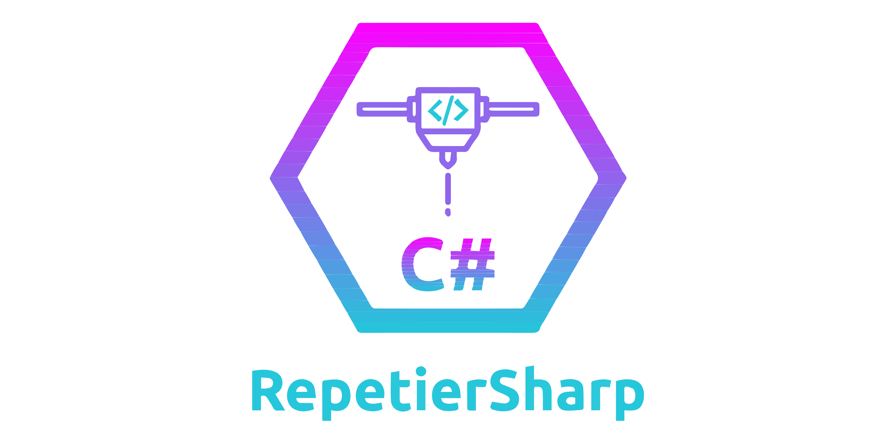

# RepetierSharp - A simple, event driven [Repetier Server](https://www.repetier-server.com/ "Repetier Server") client

## Introduction

RepetierSharp is a simple, event-driven client which encapsulates the WebSocket and REST API of the Repetier Server
software to manage your printers.

*Disclaimer: This project is not affiliated with Repetier Server or Hot-World GmbH & Co. KG.*

### What is Repetier Server?

> "Repetier-Server is the professional all-in-one solution to control and manage your 3d printers and to get the most
> out of it."

https://www.repetier-server.com/

### Versioning

This library is up-to-date with RepetierServer version 1.4.x. It is downwards compatible and working with earlier versions, but there is the possibility of incompatibility for certain events/commands when using RepetierSharp with earlier
versions due to undocumented changes in the Repetier Server API.

See the [Changelog](Changelog.md) for a more detailed overview off added/changed features.

### Framework support

RepetierSharp version 0.2.0+ supports .NET 6 and .NET 8.

## Documentation

The [wiki](https://github.com/Z0rdak/RepetierSharp/wiki) for the 0.2.0 version is still under construction.  If you have any issues feel free to open an issue.

## Contribution

If you have any issues or found bugs feel free to open an issue.
